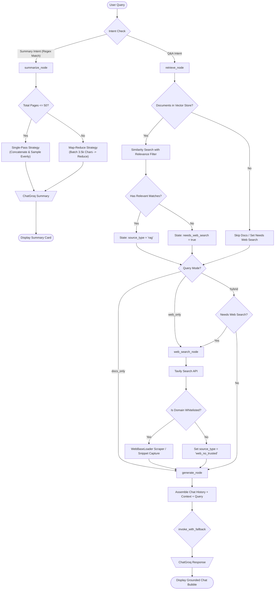
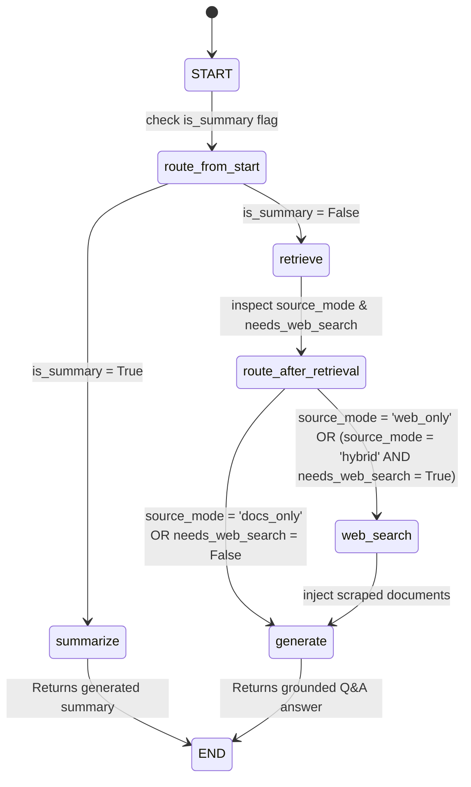
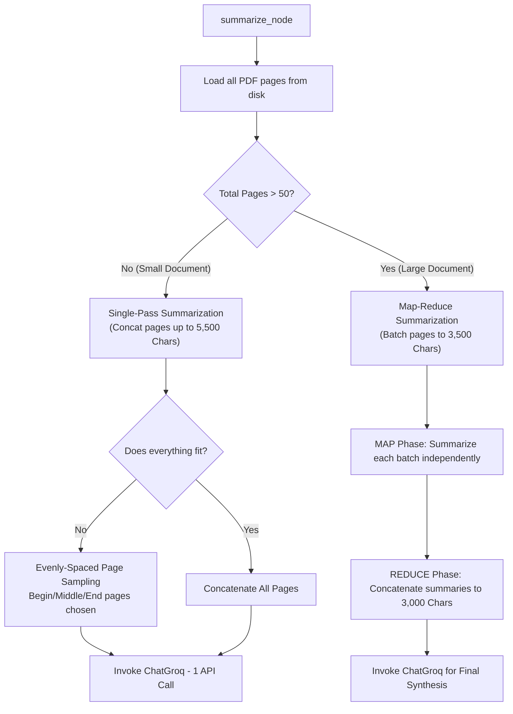
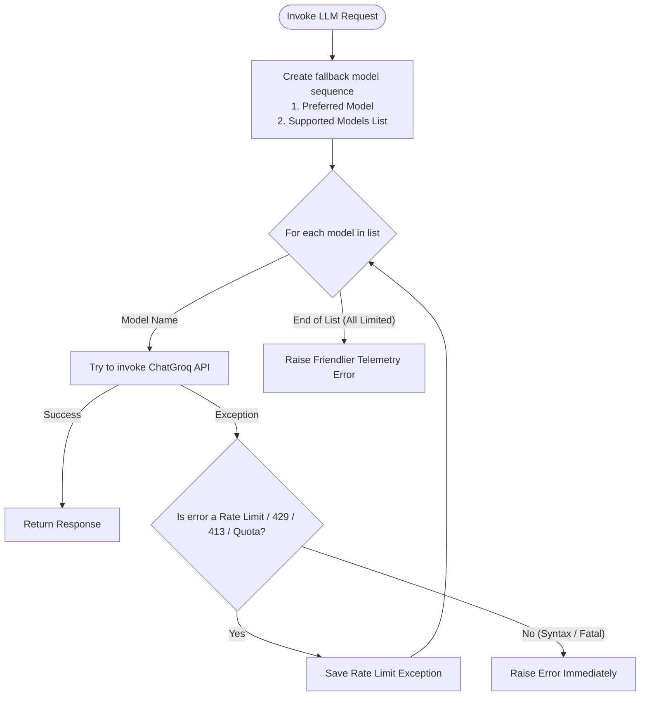

# NeuralRAG: Intelligent Research & Retrieval Agent

NeuralRAG is an advanced Retrieval-Augmented Generation (RAG) platform built on top of **LangGraph**, **Streamlit**, and **ChatGroq**. It dynamically routes user questions across vector stores and Whitelisted Web Search engines to generate fully grounded, source-attributed responses. It features a custom glassmorphic UI, real-time workflow tracking, and budget-aware adaptive summarization.

---

## 🗺️ High-Level System Architecture

The following diagram illustrates how NeuralRAG handles query routing, data ingestion, document processing, and whitelisted web cross-referencing.



---

## ⚡ LangGraph State Machine & Workflow

NeuralRAG models its execution logic as a stateful graph (`StateGraph`) using LangGraph. The graph coordinates conditional routing, parallel execution tracks, and error mitigation.



---

## 📦 Project Structure

```
NEURAL_RAG/
│
├── requirements.txt            # Main Python dependency manifest
├── langgraph-node/
│   ├── .env                    # Keys (GROQ_API_KEY, TAVILY_API_KEY)
│   ├── requirements.txt        # Local copy of packages
│   │
│   ├── colab-notebooks/        # Jupyter Notebook learning curriculum
│   │   ├── Core_Components.ipynb
│   │   ├── Graph_Basics.ipynb
│   │   ├── LangGraph_Memory_External.ipynb
│   │   ├── LangGraph_ReAct.ipynb
│   │   ├── LangGraph_Router.ipynb
│   │   ├── LangGraph_Tavily.ipynb
│   │   ├── LangGraph_Tools.ipynb
│   │   └── LangGraph_Web_search.ipynb
│   │
│   └── src/
│       ├── main.py             # Streamlit App & LangGraph definition (Master Node)
│       ├── pyproject.toml      # Project configuration
│       ├── run.ps1             # PowerShell script to execute App
│       ├── favicon.png         # Brand favicon image
│       ├── trusted_sources.json# JSON list storing whitelist search domains
│       └── utils/
│           ├── __init__.py
│           ├── config.py       # Default/supported LLM constants
│           └── rag_components.py # invoke_with_fallback and Groq fallback chain
```

---

## 🔍 Inch-by-Inch Code Analysis

### 1. LangGraph State Definition (`GraphState`)
The agent's state is stored in a `TypedDict` that governs context sharing across all node operations:

```python
class GraphState(TypedDict, total=False):
    question:         str           # The user query
    history:          List[dict]    # List of message history dicts {"role", "content"}
    documents:        List[Document]# Current list of loaded LangChain documents
    sources:          List[str]     # Formatted sources used for UI rendering
    needs_web_search: bool          # Flag to trigger Tavily web search fallback
    source_type:      str           # Type descriptor: 'rag' | 'web' | 'summary' | 'web_no_trusted'
    trusted_domains:  List[str]     # Active whitelisted domain patterns
    source_mode:      str           # Active sidebar mode: 'hybrid' | 'docs_only' | 'web_only'
    is_summary:       bool          # True if a summary intent is detected
    preferred_model:  str           # Target LLM (e.g. llama-3.3-70b-versatile)
```

### 2. Node & Routing Implementation Details

#### A. Query Classification (`is_summary_intent` & `route_from_start`)
*   **Regex Intent Detection**: Uses `_SUMMARY_INTENT_RE` (matching keywords like *summarize, overview, what is this pdf about, explain this document*) to automatically detect if the user wants a full-document summary rather than a granular query.
*   **Initial Router**: `route_from_start` routes the request straight to `summarize` (avoiding chunk retrieval) or `retrieve`.

#### B. Retrieval Node (`retrieve_node`)
*   **Score Filtering Logic**: Ingested PDFs are queried in ChromaDB using `similarity_search_with_relevance_scores` (extracting the top $k=3$ chunks).
*   **Similarity vs Distance Ceilings**: ChromaDB versions can return raw cosine distances or similarity scores.
    *   If the maximum score is $>1.0$ (indicating distance), it filters chunks with a distance ceiling $\le 1.5$.
    *   Otherwise (indicating similarity), it filters chunks with a similarity score $\ge 0.1$.
*   **Fallback**: If the score API fails, it falls back to standard unscored `retriever.invoke()`.
*   **Fallback Check**: If no documents survive the score check or vector storage is offline, it sets `needs_web_search = True` to enable web search query escalation.

#### C. Web Search Node (`web_search_node`)
*   **Security Whitelist (P1 Feature)**: Inspects Tavily API results against whitelisted domains (stored in `trusted_sources.json`).
*   **Subdomain Support**: If `who.int` is whitelisted, URLs containing `epidemics.who.int` or `who.int` are allowed. If the domain list is empty, web search is blocked completely.
*   **Two-tier Scraping**:
    1.  *Tier 1 (Full Scrape)*: Uses `WebBaseLoader` to load full web content (truncated to 2,000 characters to fit context buffers).
    2.  *Tier 2 (Fallback Snippet)*: If `WebBaseLoader` encounters network blockers, it falls back to the search snippet returned directly by Tavily.

#### D. Generator Node (`generate_node`)
*   **Prompt Grounding**: Injects context from the retrieval/search nodes into a specialized prompt forcing the agent to answer *only* based on the context. If the answer is not in the context, it must state that it cannot find enough information.
*   **Fallback Enforcement**: Invokes the LLM via `invoke_with_fallback` using the user's preferred model or the system default.

---

## 📊 Token-Budgeted Adaptive Summarization

The summarization node is engineered around the **8,000 Token-Per-Minute (TPM)** rate limit of Groq's APIs. It dynamically balances speed, detail, and API constraints using two distinct strategies:



### Strategy Parameters
*   `SUMMARY_SINGLEPASS_PAGE_LIMIT = 50`: Pages threshold.
*   `SUMMARY_SINGLEPASS_CHARS = 5500`: Single-pass character limit (~1,900 tokens).
*   `SUMMARY_BATCH_CHARS = 3500`: Map-phase batch size.
*   `SUMMARY_REDUCE_CHARS = 3000`: Reduce-phase summary merge limit.

---

## 🛡️ Model Fallback Chain (`invoke_with_fallback`)

To guarantee high availability against Groq API rate limits (HTTP 429), context length limits (HTTP 413), and token quotas, all LLM calls are routed through a fallback loop.



### Supported Fallback Sequence
1.  **Llama 3.3 70B Versatile** (Default - `llama-3.3-70b-versatile`)
2.  **GPT-OSS 20B** (`openai/gpt-oss-20b`)
3.  **GPT-OSS 120B** (`openai/gpt-oss-120b`)
4.  **Llama3 70B** (`llama3-70b-8192`)
5.  **Llama3 8B** (`llama3-8b-8192`)
6.  **Mixtral 8x7B** (`mixtral-8x7b-32768`)
7.  **Gemma2 9B** (`gemma2-9b-it`)

---

## 🎨 Glassmorphic UI & Custom CSS

The interface uses custom CSS injected into Streamlit to create a modern web dashboard.

### Core Visual Elements
*   **Custom Fonts**: Imports Google Fonts **Outfit** (clean geometric sans-serif) and **JetBrains Mono** (telemetry displays).
*   **Dark Mode Glassmorphism**: Utilizes semi-transparent container backgrounds, borders, and radial background gradients:
    ```css
    --bg-base: #04060d;
    --bg-surface: rgba(10, 15, 30, 0.6);
    --border-glass: rgba(255, 255, 255, 0.05);
    ```
*   **Real-time Workflow Stepper**: Displays a step-by-step progress trace of the current LangGraph execution path (`Intent Check` → `Retrieval` → `Web Search` → `Trust Filter` → `Generator`). Nodes update status bubbles (`done`, `running`, `blocked`, `skipped`) reactively using pure HTML/CSS overlays.
*   **Welcome Navigation Grid**: Provides quick-start cards with embedded JavaScript click-handlers that auto-fill sample queries into the chat input.

---

## 🎓 Colab Notebooks Learning Curriculum

The project includes 8 hands-on Jupyter Notebooks in the `colab-notebooks` directory. Use these to explain the fundamental principles behind LangGraph:

| Notebook | Focus | Summary |
| :--- | :--- | :--- |
| **`Core_Components.ipynb`** | Base LangChain APIs | Introduces prompts, models, parser objects, and basic chaining configurations. |
| **`Graph_Basics.ipynb`** | LangGraph StateGraph | Teaches how to add nodes, edges, compile workflows, and trace state transitions. |
| **`LangGraph_Memory_External.ipynb`**| Conversation State Persistence | Demonstrates how to connect external SQLite or Postgres checkpoints for multi-turn memory. |
| **`LangGraph_ReAct.ipynb`** | Agent Loop | Explains the Reason-Action (ReAct) pattern where an agent loops recursively until a task is done. |
| **`LangGraph_Router.ipynb`** | Conditional Routing | Guides how to implement routers that check state variables and branch execution paths. |
| **`LangGraph_Tavily.ipynb`** | Search Integration | Connects the agent to Tavily search APIs to dynamically retrieve search results. |
| **`LangGraph_Tools.ipynb`** | Tool Calling | Explains how to bind schema-described python functions (tools) to LLMs. |
| **`LangGraph_Web_search.ipynb`** | Fully integrated Web Agent | Implements a simple end-to-end web search agent using state graphs. |

---

## 🚀 Getting Started

### 1. Prerequisites
Make sure you have python 3.11+ installed. Create a virtual environment and install dependencies:
```bash
# In the workspace directory:
python -m venv .venv
.\.venv\Scripts\activate
pip install -r requirements.txt
```

### 2. Configure Keys
Add your API keys to the `.env` file in `langgraph-node/.env`:
```env
GROQ_API_KEY=your_groq_api_key_here
TAVILY_API_KEY=your_tavily_api_key_here
```

### 3. Run the Application
Start the Streamlit web server using the PowerShell helper:
```powershell
cd langgraph-node/src
..\.venv\Scripts\python.exe -m streamlit run main.py
```
Or execute `./run.ps1` from the `langgraph-node/src` directory.
